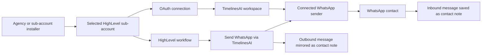

# GoHighLevel WhatsApp for agencies: sub-accounts, numbers, and rollout

Agencies should treat each HighLevel sub-account as a separate WhatsApp deployment boundary. TimelinesAI's public HighLevel listing identifies the app as a sub-account app, although both agency users and sub-account users can install it. That distinction matters: an agency user may have permission to install the app, but the current connector still binds one selected client location at a time.

The safe rollout model is simple. Pick one client sub-account, connect it with OAuth, verify which WhatsApp sender numbers are available in the workflow action, test contact creation and notes, then repeat the process for other locations. Do not select the agency row for a multi-location rollout: the current connector stops and asks the installer to choose a specific sub-account when an agency has more than one location.

## Quick answers

| Question | Answer |
|---|---|
| Is the TimelinesAI app installed at agency level? | The marketplace lists it as a sub-account app. An agency user can install it, but installation should target a sub-account. |
| Can an agency install it? | Yes. The listing allows both agency and sub-account installers. |
| Can a HighLevel workflow send WhatsApp messages? | Yes. The app provides a `Send WhatsApp via TimelinesAI` workflow action. |
| Can a workflow choose a WhatsApp sender? | The public listing says the action includes a sender-number selector. Test the available choices in each client sub-account. |
| Do WhatsApp replies appear in HighLevel? | Inbound messages are written to the matching contact as timestamped notes with a source-conversation link. |
| What if the sender is not already a contact? | The listing says the integration creates a new HighLevel contact. |
| Does one install cover every client location? | No in the current connector. Install and test each target sub-account separately. |

## The agency architecture

HighLevel separates an agency account from its client sub-accounts, often called locations. The TimelinesAI app is listed for sub-accounts. The person who starts the installation can be an agency user or a sub-account user, but the target location is the operational boundary you should plan around.

This model avoids two common mistakes. First, agency permission does not mean the connector supports agency-wide deployment. The marketplace configuration currently exposes a bulk-install capability, but the connector accepts only one selected location and errors on a multi-location agency token. Second, a sender number visible in one location should not be assumed to be available in another.

Before rollout, document four objects for every client:

1. The HighLevel sub-account that owns the workflow.
2. The TimelinesAI workspace used for the connection.
3. The WhatsApp number or numbers approved for that client.
4. The people allowed to install, edit workflows, and review conversations.

A one-row-per-client register is enough:

| Client | HighLevel sub-account | TimelinesAI workspace | Approved sender | Installer | Test status |
|---|---|---|---|---|---|
| Example client | Client location | Workspace name | +1 XXX | Agency admin | Pending |

Do not place real phone numbers in a shared public document. Use masked numbers outside the operations team.

## What the integration does inside HighLevel

The public [TimelinesAI marketplace listing](https://marketplace.gohighlevel.com/integration/69f9c25eab147118be566acd) documents three CRM behaviors.

### 1. Send WhatsApp from a workflow

The custom action is called `Send WhatsApp via TimelinesAI`. It lets the workflow builder choose a sender number, choose a message type, and use HighLevel merge fields in the message body.

That supports practical flows such as:

- sending a confirmation after a form submission;
- notifying a lead when an opportunity stage changes;
- sending a reminder before an appointment;
- following up after a defined waiting period.

The workflow still needs normal safeguards. Confirm consent, add stop conditions, cap retries, and prevent two workflows from sending the same message.

For a detailed build sequence, use the [GoHighLevel WhatsApp automation guide](https://timelines.ai/gohighlevel-whatsapp-automation).

### 2. Write WhatsApp activity to contact notes

Inbound WhatsApp messages are saved to the matching HighLevel contact as timestamped notes. The note includes a link back to the source conversation. Workflow-sent outbound messages are also mirrored to notes.

This gives sales and service users a CRM record of the exchange without claiming that HighLevel becomes the WhatsApp inbox. The public listing describes contact notes and source links, not a native shared TimelinesAI inbox embedded inside HighLevel.

### 3. Create a contact for an unknown number

When an inbound WhatsApp number does not match an existing contact, the integration creates a HighLevel contact. Agencies should test phone normalization before wider rollout. The same person may appear as `+1...`, a local number, or a formatted number from another source. A poor normalization rule can create duplicates.

## How to plan multiple WhatsApp numbers

The workflow action includes a sender selector. That does not answer every multi-number question an agency will have.

Use a number ownership matrix before building workflows:

| Sender number | Brand or client | Market | Approved workflows | Backup owner |
|---|---|---|---|---|
| Masked number A | Client A | US | Lead reply, booking reminder | Client ops |
| Masked number B | Client A | UK | Lead reply | Agency ops |
| Masked number C | Client B | ES | Booking reminder | Client admin |

Then test the selector inside each sub-account:

- Does it show only numbers intended for that client?
- Does the selected number persist after the workflow is saved?
- Can a user without workspace access edit the action?
- What happens if the number disconnects?
- Does cloning a workflow keep the original sender selection?

These are acceptance tests, not assumptions. The marketplace listing confirms that a sender can be selected. It does not publicly document how sender availability is isolated across several client sub-accounts.

## A safe agency rollout checklist

### 1. Choose one pilot location

Start with a cooperative client, a small workflow, and a low-risk use case. Appointment reminders or internal test contacts are easier to validate than a large reactivation campaign.

### 2. Confirm ownership

Write down who owns the HighLevel sub-account, TimelinesAI workspace, WhatsApp number, workflow, and customer-data policy. Decide who handles reconnects and failed sends.

### 3. Install in the target sub-account

Use the listing's OAuth flow. The public listing says users do not need to copy API tokens. Make sure the browser is operating in the intended client location before approving access.

The step-by-step connection flow is covered in [How to connect WhatsApp to GoHighLevel](https://timelines.ai/connect-whatsapp-to-gohighlevel).

### 4. Inspect the sender selector

Create a draft workflow and open the TimelinesAI action. Record which sender numbers are available. Stop if a number from another client appears unexpectedly.

### 5. Test outbound delivery

Send to an internal test contact. Check the WhatsApp account used, the rendered merge fields, delivery, and the note created on the contact.

### 6. Test inbound matching

Reply from the test contact. Confirm that the message is written to the correct HighLevel contact and that the source-conversation link opens the expected TimelinesAI conversation.

### 7. Test an unknown number

Use a controlled number that is not already in HighLevel. Confirm contact creation, phone formatting, attribution fields, and ownership assignment. Remove the test record afterward if your data policy requires it.

### 8. Add workflow controls

Add consent and suppression checks. Define quiet hours. Prevent duplicate sends when a lead enters the same workflow twice. Decide what happens when the selected WhatsApp number disconnects.

### 9. Record the result

For each client location, save the install date, installer, sender number, tested workflows, test contacts, and rollback owner. Keep screenshots free of customer data.

### 10. Repeat, do not clone blindly

A cloned HighLevel workflow may retain fields or selections from the source location. Open every TimelinesAI action after cloning and verify the sender, merge fields, and stop rules.

## When this setup fits

This model works well when an agency wants HighLevel workflows and CRM records to use an existing WhatsApp operation.

Use it when:

- the client already works from HighLevel contacts and workflows;
- the client needs WhatsApp activity recorded on the CRM contact;
- the agency can define clear ownership for each number and sub-account;
- the team can test every location before enabling production sends.

Pause the rollout when:

- nobody can confirm which client owns a sender number;
- several sub-accounts appear to share data unexpectedly;
- users expect a full WhatsApp inbox inside HighLevel rather than contact notes;
- the team cannot enforce consent, quiet hours, or suppression rules;
- a cloned workflow still points to another client's sender.

For commercial planning, compare [GoHighLevel WhatsApp integration pricing](https://timelines.ai/gohighlevel-whatsapp-pricing) with the number of client locations, senders, and operators you expect to support.

## Questions to answer before scaling past the pilot

The current supported model is one selected HighLevel sub-account per connection. The agency should still verify these operational points in its own environment:

1. Which connected WhatsApp numbers appear in each sub-account's workflow action?
2. Does uninstalling the app from one sub-account affect another?
3. Are contact creation and notes always isolated to the installing location?
4. Does cloning a workflow retain a sender from the source location?
5. Who owns reconnects and failed sends for each client?

Treat those points as rollout tests until a working account confirms the current behavior.

## FAQ

### Is TimelinesAI's HighLevel app agency-wide?

The marketplace identifies it as a sub-account app. Agency users can install it, but the current connector supports one selected client sub-account at a time. For an agency with several locations, select and install each target sub-account separately.

### Can an agency use different WhatsApp numbers for different clients?

The workflow action has a sender-number selector. Verify the available sender list inside each client location before enabling the workflow. The public listing does not document cross-sub-account number isolation.

### Where do WhatsApp replies appear in HighLevel?

Inbound messages appear as timestamped notes on the matching contact, with a link to the source conversation. Unknown numbers create new contacts.

### Does HighLevel become the team's WhatsApp inbox?

The public listing documents workflow sending and contact-note synchronization. It does not describe a native TimelinesAI shared inbox inside HighLevel.

### Can an agency clone the same workflow into every sub-account?

It can reuse the workflow design, but each cloned action must be checked for sender choice, merge fields, consent rules, and stop conditions. Do not assume location-specific values change automatically.

### What should an agency test first?

Run one controlled outbound message, one reply from a known contact, and one reply from an unknown number. Verify sender identity, contact matching, note creation, and the source-conversation link.

## Next step

Start with the [GoHighLevel WhatsApp integration overview](https://timelines.ai/gohighlevel-whatsapp-integration), then connect one test sub-account and run the acceptance checklist above before adding more client locations.
